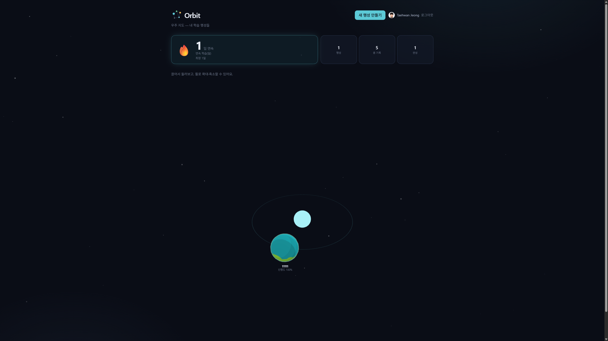

# 🪐 Orbit

> **공부하면 내 우주가 자라나는 학습 동기부여 웹앱**

학습 주제를 하나의 **행성**으로 만들고, 기록을 남길수록 그 행성이 황량한 암석에서 생명이 사는 행성으로 **테라포밍(0 → 100%)** 됩니다. 성장이 눈에 보이니, 계속 공부하게 됩니다.

<p>
  <a href="https://orbit-ten-inky.vercel.app"><strong>🚀 라이브 데모 — orbit-ten-inky.vercel.app</strong></a>
</p>

<p>
  
  
  
  
  
</p>

<br />

## 📸 스크린샷

<!--
  아래 경로에 이미지를 넣으면 렌더링됩니다. 추천 구성:
  - docs/screenshot-space-map.png : 여러 행성이 떠 있는 우주 지도(메인 화면)
  - docs/screenshot-planet.png    : 3D 행성 상세 + 진행도(테라포밍) 화면
  - docs/screenshot-record.png    : 마크다운 학습 기록 작성 화면
  가로로 넓은 대표 이미지 하나를 맨 위에 두면 첫인상이 좋습니다.
-->



<br />

## ✨ 주요 기능

- **🌍 학습 = 테라포밍** — 학습 주제마다 행성 하나. 기록을 남길 때마다 진행도가 오르고, 행성이 단계별로 변합니다. (암석 → 대기 → 바다 → 생명)
- **🪐 3D 행성 & 우주 지도** — Three.js(React Three Fiber)로 렌더링한 행성이 나만의 우주 지도에 쌓입니다.
- **📝 마크다운 학습 기록** — 마크다운으로 기록을 작성하고, 이미지는 **클립보드 붙여넣기**로 바로 업로드됩니다.
- **🔥 연속 학습 스트릭** — 며칠째 이어서 공부 중인지 한눈에.
- **🎉 100% 완성 축하 연출** — 행성을 완성하면 축하 애니메이션으로 마무리.
- **🔐 구글 OAuth 로그인** — 별도 가입 없이 구글 계정으로 시작.

<br />

## 🛠 기술 스택

### Frontend
- **Next.js 16** (App Router) · **React 19** · **TypeScript**
- **Three.js** — `@react-three/fiber` · `@react-three/drei` (3D 행성 렌더링)
- **Tailwind CSS v4**
- **[@usetaehwan/ui](https://www.npmjs.com/package/@usetaehwan/ui)** — 자체 제작한 디자인 시스템 npm 패키지를 우주 테마로 재사용

### Backend
- **FastAPI** (Python 3.12)
- **PostgreSQL** · **SQLAlchemy** (ORM) · **Pydantic** (입출력 계약)
- **Google OAuth** 소셜 로그인 · **JWT** 세션

### Infra
| 역할 | 서비스 |
| --- | --- |
| 프론트엔드 호스팅 | **Vercel** |
| 백엔드 호스팅 | **Railway** |
| 데이터베이스 | **Neon** (Serverless PostgreSQL) |
| 이미지 저장소 | **Cloudinary** |

<br />

## 🏛 아키텍처

프론트엔드 개발자가 백엔드·DB·인프라·배포까지 직접 구성하며 **풀스택 구조를 이해하기 위해** 만든 프로젝트입니다. 그래서 구조를 특히 신경 썼습니다.

**백엔드 — 단방향 계층 구조**

```
api  →  services  →  models
(HTTP 흐름)   (비즈니스 로직)   (DB 테이블)
```

- 라우터(`api`)는 얇게: 요청 검증 → 서비스 호출 → 응답. 계산·복잡한 쿼리는 두지 않습니다.
- 레이어를 건너뛰거나 역방향으로 의존하지 않습니다. (`schemas`는 api 경계에서만 사용)

**진행도·스트릭은 저장하지 않고 계산합니다**

- 행성의 **진행도(%)** 는 컬럼에 저장하지 않고, `기록 수 ÷ 난이도별 필요 수`로 매번 계산합니다.
- **연속 학습 스트릭**도 저장하지 않고, 기록들의 작성 시각(KST 기준 자정)으로 계산합니다.
- 덕분에 기록을 지워도 값이 저절로 맞아, **데이터가 어긋난 상태 자체가 존재할 수 없습니다.**

<br />

## 🚀 로컬 실행

> 필요한 환경 변수의 **전체 목록과 설명**은 각 `.env.example` 파일에 있습니다.
> 아래는 최소 실행 순서만 정리했습니다.

### 1. 백엔드

```bash
cd backend
python3 -m venv venv
source venv/bin/activate
pip install -r requirements.txt

cp .env.example .env   # 값은 아래 안내대로 채우기
fastapi dev app/main.py
# → http://localhost:8000  (API 문서: /docs)
```

`backend/.env`에 채워야 하는 값 (상세는 `backend/.env.example` 참고):

| 키 | 설명 |
| --- | --- |
| `DATABASE_URL` | PostgreSQL 연결 문자열 (로컬 또는 Neon) |
| `GOOGLE_CLIENT_ID` / `GOOGLE_CLIENT_SECRET` | 구글 OAuth 자격 증명 (Google Cloud Console) |
| `JWT_SECRET` | 세션 JWT 서명 키 (`python -c "import secrets; print(secrets.token_urlsafe(48))"` 로 생성) |
| `CLOUDINARY_CLOUD_NAME` / `CLOUDINARY_API_KEY` / `CLOUDINARY_API_SECRET` | 이미지 업로드용 Cloudinary 자격 증명 |

> 배포 관련 값(`CORS_ORIGINS`, `GOOGLE_REDIRECT_URI`, `FRONTEND_URL`, 쿠키 속성)은 비워두면 로컬 기본값으로 동작합니다.
> ⚠️ 실제 키 값은 `.env`에만 두고 **절대 커밋하지 마세요.** (`.env.example`에는 형식·설명만)

### 2. 프론트엔드

```bash
cd frontend
npm install

# .env.local 생성 후 아래 값 작성
#   NEXT_PUBLIC_API_URL=http://localhost:8000   (기본값과 동일 · 배포 시 백엔드 주소로 변경)
npm run dev
# → http://localhost:3000
```

### 동시 실행 (선택)

의존성 설치를 마쳤다면 루트에서 한 번에 실행할 수 있습니다.

```bash
./scripts/dev.sh    # 백엔드 :8000 + 프론트 :3000 동시 실행 (Ctrl+C 한 번으로 둘 다 종료)
```

### 테스트

```bash
./scripts/test-all.sh          # 백엔드 + 프론트 유닛 + e2e 한 번에
# 부분 실행: ./scripts/test-all.sh backend | unit | e2e
```

<br />

## 📁 프로젝트 구조

모노레포입니다.

```
orbit/
├── frontend/                 # Next.js (App Router)
│   ├── app/                  # 라우트/페이지 (얇게 — 조립만)
│   ├── features/             # 도메인별 컴포넌트·훅 (planets, records, streak, auth)
│   ├── components/           # 재사용 UI · 3D 행성 렌더링
│   ├── lib/api/              # 백엔드 호출 클라이언트 (fetch는 여기에만)
│   └── types/                # 공용 도메인 타입
│
├── backend/                  # FastAPI
│   └── app/
│       ├── main.py           # 앱 조립 (lifespan, CORS, 라우터 등록)
│       ├── core/             # 설정(config)·DB(engine/session)
│       ├── models/           # SQLAlchemy 테이블 (planet, record, user)
│       ├── schemas/          # Pydantic 입출력 계약
│       ├── api/              # 엔드포인트 (auth, planets, records, uploads)
│       └── services/         # 비즈니스 로직 (progress, streak, oauth …)
│
└── scripts/                  # dev.sh (동시 실행) · test-all.sh (전체 테스트)
```

<br />

---

made by [Taehwan Jeong](https://usetaehwan.page)
